<div align="center">

<picture>
  <source media="(prefers-color-scheme: dark)" srcset="./packages/storymap-ui/public/logo-dark.png">
  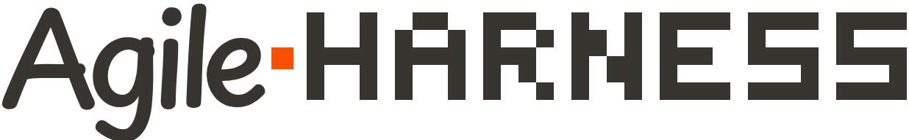
</picture>

**Spec-driven development where the spec is a board, and the columns do the work —
with the laptop closed.**

One markdown file per story carries the whole lifecycle. Some columns *refuse* a card that
isn't ready. Others *run an agent* the moment it arrives. It runs as a service, so the
work continues whether or not you are watching.

[](./LICENSE)
[](https://github.com/kapstanhq/agileharness/actions/workflows/ci.yml)
[](https://github.com/kapstanhq/agileharness/actions/workflows/security.yml)
[](./AGENTS.md)
[](https://bun.sh)
[](./docs/how-it-works.md#built-on-claude-code)

[Quickstart](#quickstart) · [Features](#features) · [How it compares](#how-it-compares) ·
[Screenshots](#what-it-looks-like) · [Security](#security) · [How it works](./docs/how-it-works.md)

</div>

---

Your coding agent is good at making a change you already specified. It is not good at deciding
what to build, proving the thing is done, or getting it out the door. That gap is where you go
back to being the bottleneck — not writing code, but writing specs, checking acceptance criteria,
and remembering what actually shipped.

AgileHarness closes it by putting **the product itself in your repository**, next to the code, and
giving every column of the board a **precondition an agent has to satisfy before the card can
move**. At the top of it sits a **PRD** — a real one, sixteen sections, three of them written for
the agent rather than the reader — and every step inherits it. The board is not a queue you hand to
agents. It's a contract that refuses work that isn't ready — and it keeps enforcing it while you're
asleep.

> **It runs on the Claude Code CLI, and that is not a detail.** The engine spawns the `claude`
> binary for every step that works. There is no provider abstraction — the CLI is proprietary, the
> account is yours, and the runs spend your tokens. What that buys, and what still works without
> it, is in [Built on Claude Code](./docs/how-it-works.md#built-on-claude-code).


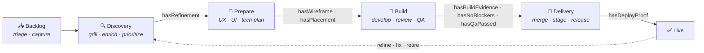
```mermaid
flowchart LR
  B["📥 Backlog<br/><i>triage · capture</i>"]
  D["🔍 Discovery<br/><i>grill · enrich · prioritize</i>"]
  P["📐 Prepare<br/><i>UX · UI · tech plan</i>"]
  C["🔨 Build<br/><i>develop · review · QA</i>"]
  S["🚚 Delivery<br/><i>merge · stage · release</i>"]
  L["✅ Live"]

  B --> D
  D -->|hasRefinement| P
  P -->|hasWireframe · hasPlacement| C
  C -->|hasBuildEvidence · hasNoBlockers · hasQaPassed| S
  S -->|hasDeployProof| L
  L -.->|refine · fix · retire| D
```

Every arrow with a name on it is a **gate**: a fail-closed check, evaluated from the card's
own data. `hasQaPassed` is not a checkbox someone ticks — it's a field a QA run wrote,
with the commit it validated. A card that skips a step gets stopped by the next one.

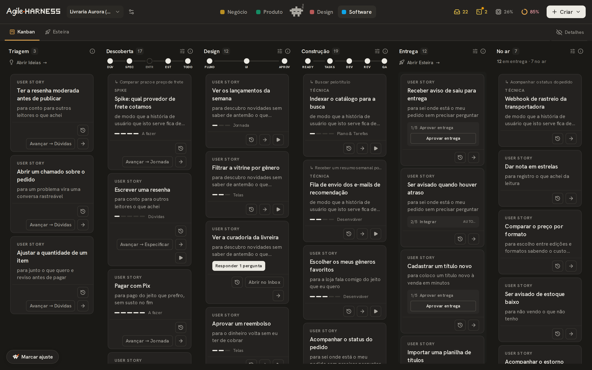

<sub>The demo board that ships with the repository: a fictional bookstore. Each stage shows its inner
steps as a track of dots, and a card carries the action it is waiting for — <i>Avançar → Dúvidas</i>
(advance), <i>Responder 1 pergunta</i> (a question an agent raised), <i>Aprovar entrega</i> (a human
gate). <b>The interface is in Portuguese</b> — see <a href="#project-status">Project status</a>.</sub>

## Quickstart

### One command

If you have [Claude Code](https://claude.com/claude-code), paste this and answer a handful of
questions:

```bash
git clone https://github.com/kapstanhq/agileharness && cd agileharness && claude "/harness-setup"
```

That is the whole install. The skill **measures this host** — the CLI it will spawn agents with,
resolved the way the *service* would resolve it and not the way your shell does, the sandbox, git
identity, the inheritable pipeline, whether runtime secrets are outside git — then **fixes what it
can without asking** and stops only for decisions that are yours:

- **A repository, or an idea?** Either way it writes the **PRD first**, because everything else
  descends from it. An idea gets interviewed into one — one question at a time, drafting rather
  than interrogating — and the Lean Canvas, the story map and the first backlog come out of it. An
  existing project gets its PRD proposed from what the code already ships, or imports one you
  already wrote. No code required to start.
- **Local, or a VPS?** It explains what a VPS is, what it costs and why it matters *here* before
  it asks — the premise is that work continues while you are not watching, and on a laptop you are
  the thing that has to stay awake. It configures the machine it is running on, so for a VPS you
  run the same command over there and it writes the service, the proxy and the log rule. Local is
  a fine answer, and moving later costs nothing: the board is files in your repository.
- **Arm the autorun?** The one that spends your tokens. The default is no.
- **Open the MCP surface?** For driving the board from the Claude app on your phone.

It re-measures on every run, so running it twice reports what is already true instead of redoing
it — and it finishes by **proving** the install (the service answers, a tool call returns, a real
card crosses a column) rather than declaring it.

Two things worth knowing before you paste it. It will ask for **sudo** once, to install the two
packages the per-run sandbox needs — the one step that needs your password, and the one whose
absence silently downgrades every autonomous run afterwards. And if your project lives in **another repository**,
have its absolute path ready: root detection cannot tell "the tool" from "your product" on its own,
so it asks rather than guesses.

Already inside a Claude Code session, in this repository? `/harness-setup` on its own does the same
thing.

### Or by hand

```bash
# 1 — prerequisites (Debian/Ubuntu; see the note below, this one is not optional)
sudo apt install bubblewrap socat

# 2 — build and run
bun install
cd packages/storymap-ui
bun run build          # ~4 minutes: ~28 App Router pages. It did not hang.
bun run start
```

Open **http://127.0.0.1:3008** and pick the `demo` board — a fictional bookstore mapped as
activities → steps → stories. It ships **disarmed**: no column fires an agent. An example should
never spend the tokens of someone who just cloned a repository.

The host measurement is available on its own, with no agent involved:

```bash
node dist/ah-server.mjs --preflight
```

**Requirements.** [Bun](https://bun.sh), Node 20+, and the **Claude Code CLI** — not bundled, not
optional, and the reason it isn't is [its own section](./docs/how-it-works.md#built-on-claude-code).
Change the port with `AGILEHARNESS_PORT` and the CLI's location with `AGILEHARNESS_CLAUDE`.

<details>
<summary><b>Why the <code>apt install</code> is a prerequisite and not a suggestion</b></summary>

Debian and Ubuntu don't ship `bubblewrap` or `socat`. Without them the per-run containment
doesn't come up, and the default **downgrades every full-autonomy run**: the agent loses
Bash, and the autorun that writes code stops working. The degradation is loud in the log,
but the symptom you notice first is a step failing for lack of a shell — not "install
bubblewrap".

- **Fedora**: `sudo dnf install bubblewrap socat`
- **macOS**: nothing to install — Seatbelt is native.
- **Ubuntu 23.10+** additionally restricts unprivileged user namespaces, which is what
  bubblewrap depends on. [`SECURITY.md`](./SECURITY.md) measures the case and lists the
  ways out.

</details>

<details>
<summary><b>Running it as a service, so it survives the laptop closing</b></summary>

`bun run start` dies with your terminal. The topology this tool was built for is a service that
restarts on boot and keeps working while you are asleep — and the unit that does that is
**generated for your machine**, not copied from a template:

```bash
node dist/ah-server.mjs --generate-systemd-unit
```

It prints the unit and the commands to install it. It never writes to `/etc/systemd/system`
itself — that is more privileged than issuing a credential, which also only prints.

The part that matters is that it pins the **absolute address** of every binary the engine
spawns, rather than trusting the unit's `PATH`. That is not decoration. A service unit pins a
much shorter `PATH` than your shell, and when the Claude Code CLI moved to `~/.local/bin` it
fell outside it: every agent spawn failed for six days with an error that dies inside a card's
console and never reaches the system journal. A declared absolute path fails loudly instead,
naming the variable to fix.

It refuses to emit anything if a binary does not resolve — a unit pinning a path that does not
exist looks like configuration and behaves like a bug.

Once it is up, wire your client to the board:

```bash
node dist/ah-server.mjs --generate-mcp-handle --level write
node dist/ah-server.mjs --print-mcp-client-config --credential <the value it printed>
```

That prints the `claude mcp add` line, an equivalent `.mcp.json`, and — with `--url` — the
public address for the phone app's connector. The credential travels in the URL path, so a
reverse proxy in front of this needs a redaction rule before you publish it; `SECURITY.md`
measures that case.

</details>

<details>
<summary><b>Pointing it at another repository</b></summary>

AgileHarness operates on the repository it runs in, found by walking up for `turbo.json`,
`.git`, or `storymap/boards` — or declared explicitly with `STORYMAP_TARGET=/path/to/repo`.
It requires the **root**: pointing it at a subdirectory is refused on purpose, because git
operations resolve upward and would reach the repository outside.

If you downloaded the ZIP instead of cloning, there is no `.git`: the extracted folder is
still found by the `storymap/boards` that ships in it, and the engine comes up **inert** —
it serves the board and does not act on the repository — until you run `git init` or point
`STORYMAP_TARGET` at a real checkout.

Two things move when you target another repo:

**1 · Runtime state is born in the target repository.** `storymap/.runner/` holds
credentials — the operator token (UI login), the session signing secret, the MCP token and
the handles. Any one of them operates your board, and the board spawns agents with execution
power. The tool creates those files at `0600` and, on first boot, **seeds a
`storymap/.gitignore`** in the target covering `.runner/`. The `0600` defends against
another user on the machine; the ignore rule defends against the repository. If you had
already committed the directory, boot warns you: ignoring it later does **not** untrack what
is in the index, and the remedy is `git rm -r --cached storymap/.runner` **and rotating**
the secrets. A secret that entered a commit is a leaked secret, private repository or not.

**2 · The inheritable pipeline is looked up in the target.** Every board inherits from
`storymap/boards/_base/board.yaml`, and under `STORYMAP_TARGET` that path resolves in the
target's tree — where it doesn't exist yet. Copy it once:

```bash
mkdir -p "$STORYMAP_TARGET/storymap/boards/_base"
cp storymap/boards/_base/board.yaml "$STORYMAP_TARGET/storymap/boards/_base/"
```

Without it, `register_board` **refuses** — and says exactly this — instead of creating a
board with no columns, no gates and no autorun that would show up in the listing as if it
were ready.

</details>

### For agents

If you are an agent, read [`AGENTS.md`](./AGENTS.md) — it's the short route.

The MCP endpoint is off until you turn it on. Nothing enables it for you:

```bash
node dist/ah-server.mjs --generate-mcp-token
```

## Features

**A PRD that agents actually read.** The board's highest document — sixteen sections, six required,
in your repo at `storymap/boards/<board>/docs/prd.md`. Positioning, the business metric and the
target outcome are sections of it, and everything below descends from it: the Lean Canvas is its
one-page compression, the story backbone comes out of its **journeys**, the personas out of its
**audience**. Three sections exist for the agent rather than the reader — **decisions already
made** (an agent that doesn't know a decision was taken will take its own), **journeys** (what
turns free text into a map instead of a flat list), and **done when** (verification criteria —
"it works" is not one). What reaches a prompt is a capped digest, not the whole document; an agent
that needs the rest calls `read_doc`. The file is **human-owned**: an unattended run that
edits it directly is refused, and the refusal names the proposal path — a draft, with a diff, for
someone to approve. The chat on the screen writes it directly, because there a human is already
reading every word.

**Story mapping, not a task list.** Activities → steps → stories, the Jeff Patton model, with
releases as horizontal slices. Delivery work (technical, bug, chore, spike) attaches to the
map node it *serves*, so infrastructure work never floats free of the user value it enables.

**Product frameworks built in.** RICE, KANO, the AAARRR funnel and anchored WSJF are card
fields the prioritization skill fills and the board sorts by. Ideas live in a separate
opportunity space and link to the stories that address them; a Lean Canvas and a persona /
system vocabulary give agents the shared nouns.

**Gates.** Nineteen named, declarative preconditions, evaluated from the card's own data —
`hasAcceptance`, `hasRice`, `hasPrioritization`, `hasWireframe`, `hasPlacement`, `hasTechPlan`,
`hasTasks`, `hasBuildEvidence`, `hasCriteriaSpecs`, `hasNoBlockers`, `hasQaPassed`, `hasStaged`,
`hasReleased`, `hasDeployProof` and the reentry briefs. Fail-closed: a gate that cannot measure
refuses rather than passes.

**Autorun.** Per-column triggers, a concurrency cap, light and heavy lanes, an isolated
worktree per run, and live console output. Arming a board is a second, deliberate gesture —
a board is registered disarmed.

**Merge train.** N sessions work in parallel, each in an ephemeral git worktree. Integration
is serialized through a train that pins the submitted sha, runs the affected test suite as a
gate, and splits the result: product code to the staging branch, board data to `main`. A
conflict goes back to the session that caused it, not to the operator's lap.

**Design as data.** Beyond the [wireframe DSL](./docs/how-it-works.md#wireframes-the-llm-authors-a-tree-the-code-draws-the-picture): a canvas of screens, components, flows and
notes, a journey graph, structured feedback threaded per artifact, and a published style guide
audited for AA contrast — plus an overlay that turns a click on the *running* interface into a
card, a refinement, or a paste into a live agent session.

**MCP-native.** 107 tools (67 for the board, 40 for dev and ops) plus four resources that
hand an agent the pipeline contract before its first call. The acceptance criterion for this
tool is that *an agent with nothing but MCP and [`AGENTS.md`](./AGENTS.md) can register an
app, arm a board, create a card and watch it cross a column* — with no human in the loop.

**An operator's cockpit.** A fleet view of live sessions with their claims and worktrees, a
per-run token and cost ledger, terminal attach over WebSocket, a publish queue with an idle
window, and an inbox where the things that actually need a human — approvals, open questions,
parked conflicts — land in one place.

## How it compares

Three families of tools live near this one, and all three are good at what they do.

| | **Spec-driven toolkits**<br/><sub>Spec Kit · Kiro · Tessl</sub> | **Agent orchestrators**<br/><sub>Vibe Kanban · Conductor · Claude Squad</sub> | **Multi-agent frameworks**<br/><sub>Hermes · CrewAI · AutoGen · LangGraph</sub> | **AgileHarness** |
|---|---|---|---|---|
| **Unit of work** | a feature spec | a task or prompt | a goal, decomposed at runtime | a **user story** on a map |
| **Spec lives** | a folder of generated `.md` per feature | — | — | **one file per story**, plus sidecars |
| **Spec's lifespan** | until the code is generated | — | — | **through reentry and retirement** |
| **Where state lives** | in the spec files | app database | dispatcher DB | **markdown in your repo**, under git |
| **What stops bad work** | your review of the spec | you, at PR review | retries, circuit breakers | **gates** — declarative, fail-closed |
| **What a column does** | — | holds a card | dispatches a worker | **runs a skill** |
| **Product context** | — | — | — | **a PRD at the top** · RICE · KANO · AAARRR · WSJF · personas · opportunity tree |
| **Parallel work** | — | worktree per agent | concurrency limits | worktree per session + **merge train** with a suite gate |
| **Blast radius** | your shell | your shell | your shell | per-run jail · risk matrix with never-auto classes |

If you want to fan five agents at five tickets and review the PRs yourself, an orchestrator is
lighter and better. If you want a research agent, a coder and a reviewer to negotiate a plan at
runtime, a multi-agent framework is the right shape. If you want one feature specified carefully
before you generate it, Spec Kit is portable and model-agnostic and asks nothing of your process.

AgileHarness answers a different question: **what does a product look like when the backlog, the
acceptance criteria, the design and the release evidence all live in the same repository as the
code, and agents are the ones moving them?**

## What it looks like

Every shot below is the demo board — a fictional bookstore — on a real instance, in dark theme.

### The map: three levels, opened one at a time

The outline opens to the depth you ask for, so the same page answers "what is the shape of this
product?" and "what exactly is left in this step?".

| Activities | Steps | Stories |
|---|---|---|
| [](./docs/screenshots/03-storymap-activities.png) | [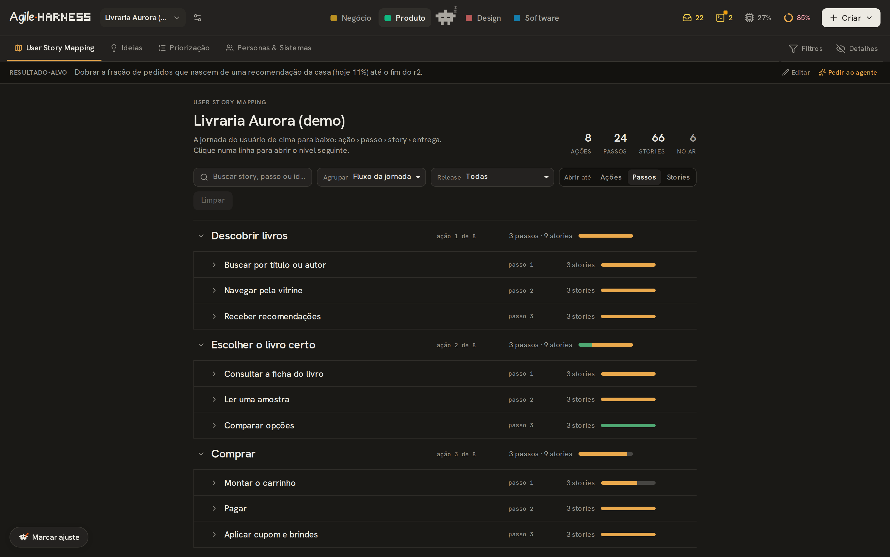](./docs/screenshots/04-storymap-steps.png) | [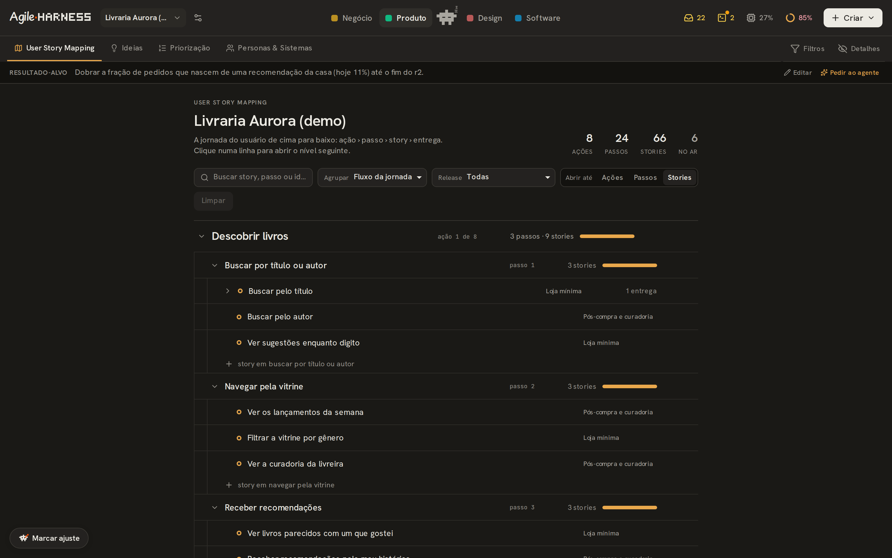](./docs/screenshots/05-storymap-stories.png) |
| 8 activities, each with its step and story counts | the journey's 24 steps, with per-step progress | every story, with the release it belongs to |

### The board and the home

| | |
|---|---|
| [](./docs/screenshots/02-kanban.png) | [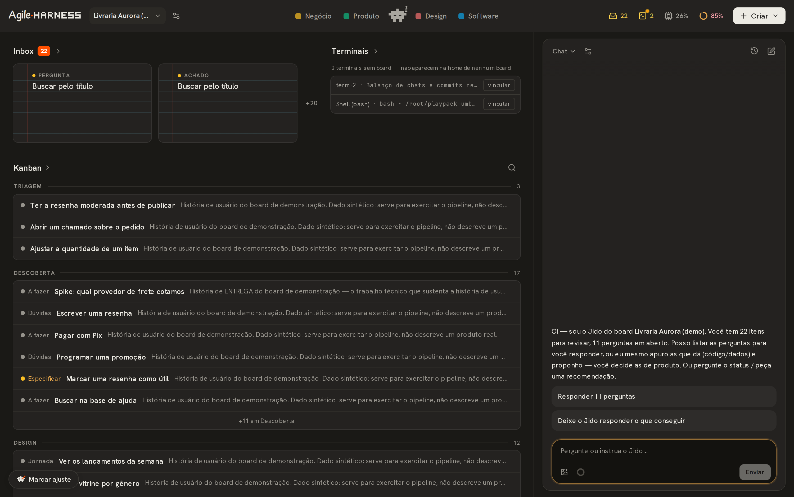](./docs/screenshots/01-home.png) |
| **Kanban.** Six stages; the dots under each are its inner steps. A card shows the one action it waits on. | **Home.** Inbox, live terminals, a Kanban preview — and the board's agent offering to answer what it can. |

### Strategy: the PRD at the top, everything else derived from it

[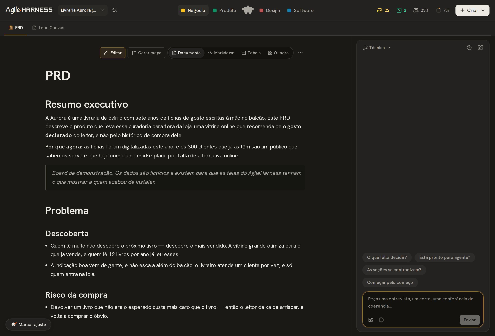](./docs/screenshots/07-prd.png)

<sub><b>The PRD.</b> Sixteen sections, six required, rendered as a document you can edit in place.
The rail on the right is the document's own chat, and the dropdown picks the <b>technique</b> — what
changes is the agent's <i>method</i>, not its powers: <i>interview</i> (one question at a time, and it
writes down what it learned), <i>sharpen</i>, <i>coherence</i> (do scope, objectives and problem tell the
same story?), <i>skepticism</i> (the assumption that cancels everything if false) and <b>ready for an
agent</b> — read this as the agent who will build from it: where would you have to guess?
<i>Generate map</i>, in the toolbar, seeds the capture with the journeys and scope so the backbone comes
out of the document instead of out of a blank page.</sub>

| Markdown is the source | Lean Canvas — board |
|---|---|
| [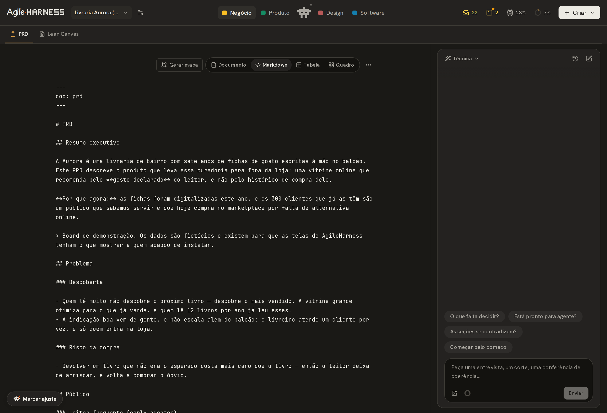](./docs/screenshots/07b-prd-markdown.png) | [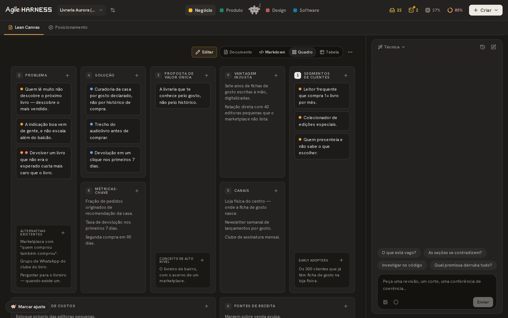](./docs/screenshots/06-lean-canvas-board.png) |
| **The same document, as its source.** Not an export — the file on disk, editable here, under git with everything else. Four views of one text: document, source, table, board. | **Lean Canvas.** The PRD's one-page compression, derived from it rather than written beside it. The grid keeps the canonical reading order. |

| Lean Canvas — table | Ideas |
|---|---|
| [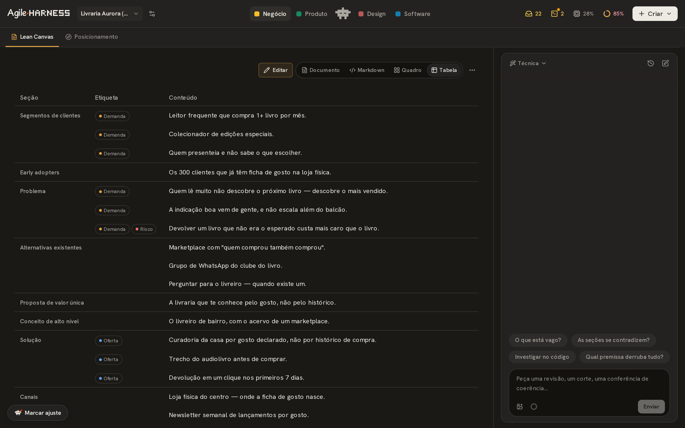](./docs/screenshots/08-lean-canvas-table.png) | [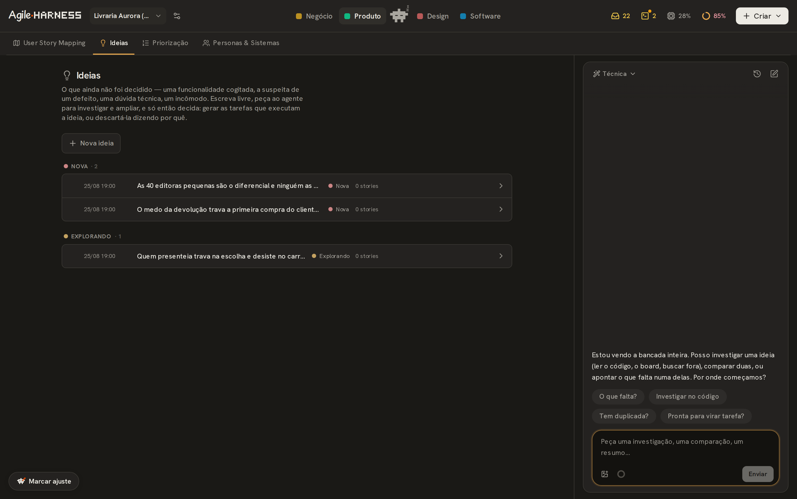](./docs/screenshots/10-ideas.png) |
| **The same canvas, as a table.** What you scan when you want the content rather than the shape. | **Ideas.** The opportunity space, kept separate from the backlog. A story links to the pain it addresses. |

| | |
|---|---|
| [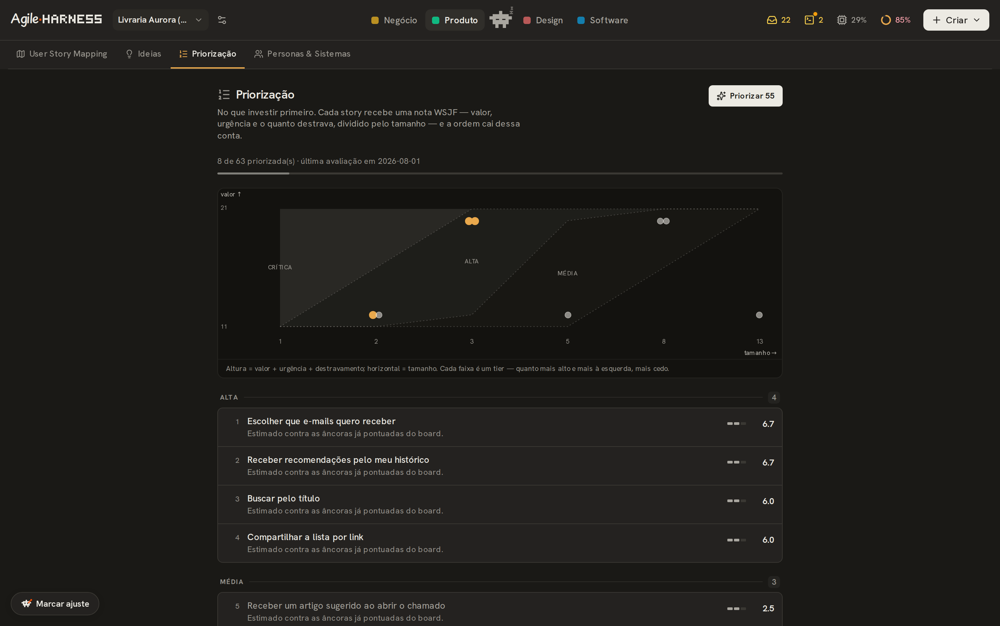](./docs/screenshots/11-prioritization.png) | [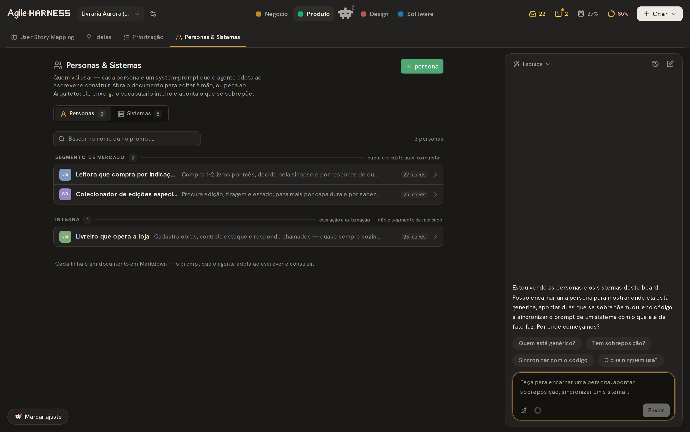](./docs/screenshots/13-vocabulary.png) |
| **Prioritization.** RICE, KANO and the funnel as sortable card data — not a spreadsheet beside the repo. | **Vocabulary.** Personas and systems as declared nouns, so an agent grounds a story in the same words you do. |

### One card, from question to proof

| | |
|---|---|
| [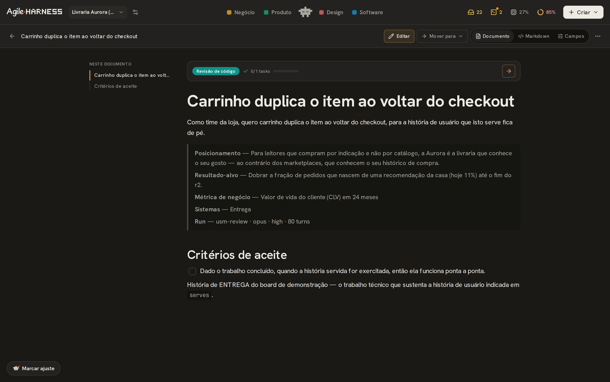](./docs/screenshots/20-card-document.png) | [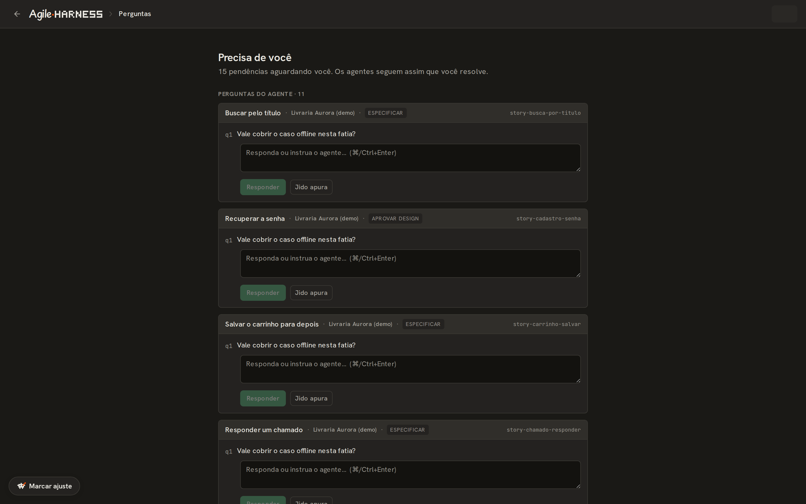](./docs/screenshots/21-questions-queue.png) |
| **The card as a document.** Narrative, criteria, tasks, findings, design and history in one scroll. | **The questions queue.** Every open question across the board — answer it, or let the agent research the ones that are facts. |

| | |
|---|---|
| [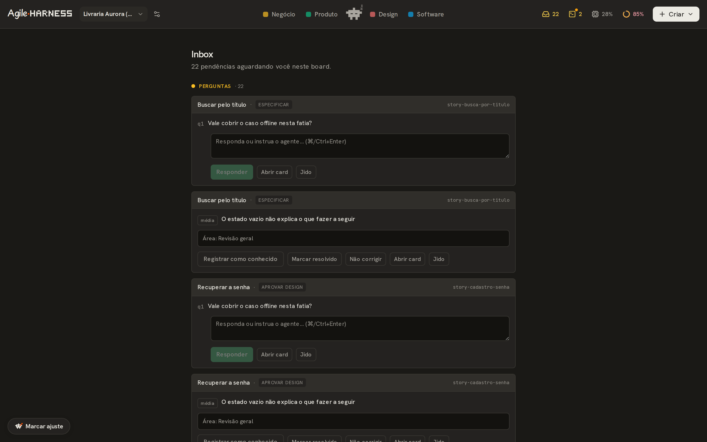](./docs/screenshots/15-inbox.png) | [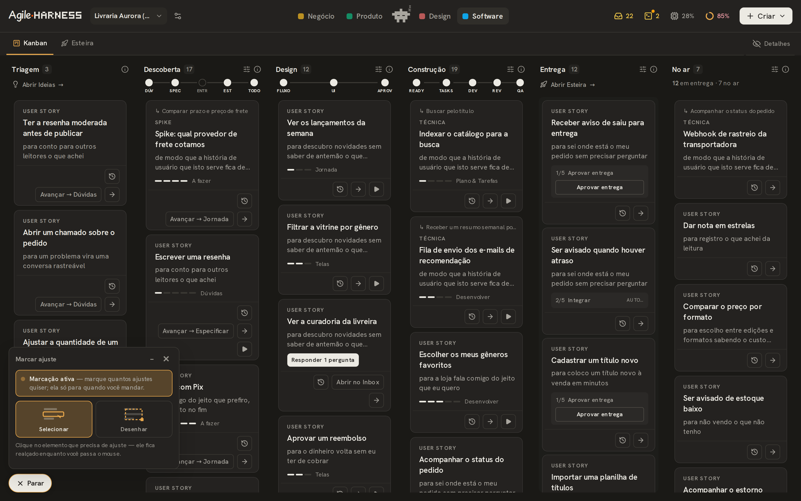](./docs/screenshots/23-feedback-overlay.png) |
| **Inbox.** One place for everything that needs a human: approvals, questions, parked conflicts. | **Feedback by clicking.** Pick an element or draw a region on the running interface; it becomes a card, a refinement, or a paste into a live agent session. |

### Design

| | |
|---|---|
| [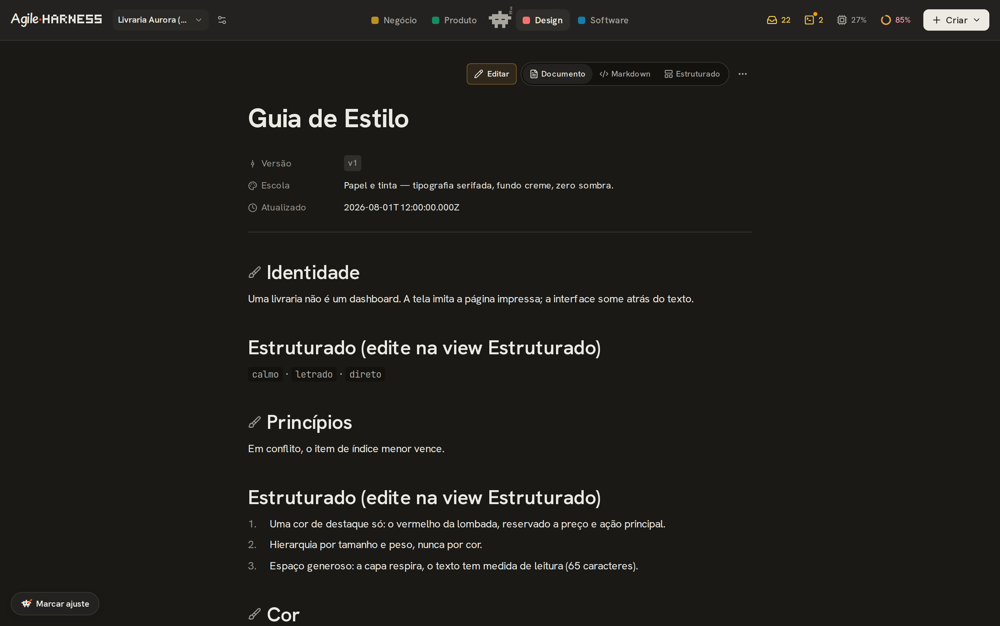](./docs/screenshots/14-style-guide.png) | [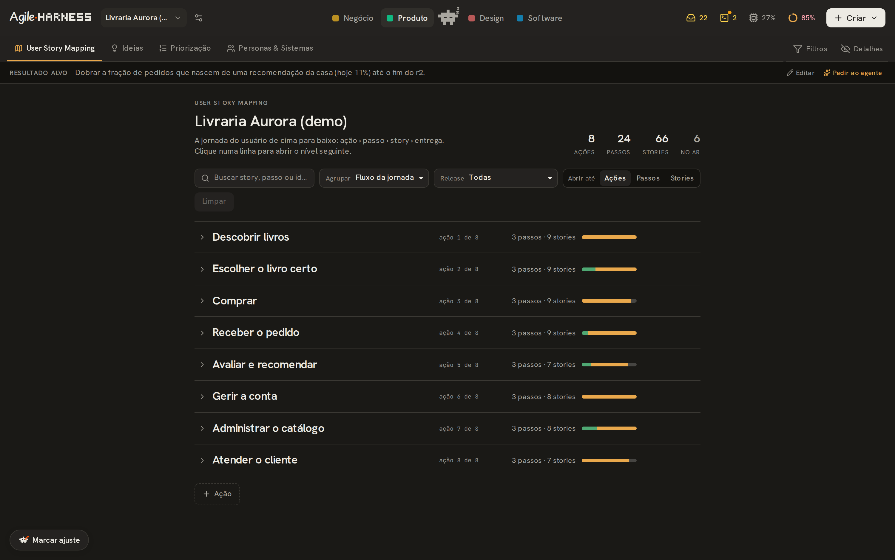](./docs/screenshots/12-product.png) |
| **Style guide.** A published source-of-truth document, audited for AA contrast. | **Product view.** The delivery lane beside the map it serves. |

## Security

Policy and reporting are in [`SECURITY.md`](./SECURITY.md); the trust model, revocation and the
checklist before exposing beyond loopback are in
[`packages/storymap-ui/SECURITY.md`](./packages/storymap-ui/SECURITY.md). The short version:

**The threat model is single-operator.** No roles, no RBAC. Whoever holds the operator credential
holds the machine, because an armed board spawns agents that edit code and can publish. What the
tool protects is the **perimeter** — session gate, cookie, WebSocket `Origin` check, MCP endpoint.
It binds to loopback by default.

**Runs are contained.** Each run gets a per-run jail — bubblewrap on Linux, Seatbelt on macOS —
with a write envelope, an egress allowlist and denied paths. Containment that cannot come up
**downgrades loudly** rather than passing silently, and CI runs a proof step, not just an install
step.

**Some risk classes can never be automatic.** Twelve classes (`read`, `write-board`, `run`,
`session`, `merge-resolve`, `deploy`, `run-free`, `destructive`, …) each carry a disposition of
`auto`, `ask` or `never`. `run-free` and `destructive` may never be `auto`, whatever a board
declares — a lint reproves the config *and* the resolver clamps `auto → ask` at call time, because
a lint can be bypassed by hand-editing YAML and a clamp cannot.

**The largest declared risk is content the board ingests.** Cards, sidecars, diffs, agent output
and free-text capture are untrusted input on their way into an agent's context. Turning any of it
into a command is in scope and is the class most likely to produce a real report.

**Supply chain is enforced, not documented.** CI runs a strong-copyleft license gate over the
published closure, an SBOM generator, an OSV query, a VEX gate with dated dispositions, a workflow
linter (pinned actions, no hostile-context interpolation, `persist-credentials: false`) and a
secret scanner that sweeps the **tracked tree** with `--fail-on-unscanned`, so an accidental blind
spot fails instead of reporting "clean".

**Reporting.** Use GitHub's private vulnerability reporting — *Security → Advisories → Report a
vulnerability*. Please don't open a public issue for an exploitable flaw: a compromised board is
arbitrary execution on the machine running it, and the window between a public report and a patch
is the attack.

## What it is not

- **Not a task tracker.** If you want a Kanban, there are better and cheaper ones. The value
  here is the column that *works*.
- **Not hosted.** It runs on your machine, in your repository, with your credentials. The
  agents it spawns run there too — and spend your tokens.
- **Not safe by default against yourself.** The brakes exist — gates, the risk matrix,
  per-run containment, human approval for the irreversible — but the design assumes an
  operator who knows what they armed.

## Documentation

| | |
|---|---|
| [`docs/how-it-works.md`](./docs/how-it-works.md) | why it exists, how much it drives, and the techniques |
| [`AGENTS.md`](./AGENTS.md) | the short route, for agents |
| [`SECURITY.md`](./SECURITY.md) | what's in scope, and how to report privately |
| [`CONTRIBUTING.md`](./CONTRIBUTING.md) | how to run it, what CI enforces, and why there is no CLA |
| [`storymap/README.md`](./storymap/README.md) | the canonical schema: cards, gates, pipeline |
| [`storymap/frameworks.md`](./storymap/frameworks.md) | the built-in product frameworks (RICE, KANO, funnel) |
| [`storymap/settings.yaml`](./storymap/settings.yaml) | every configuration key, commented |
| [`.ossignore`](./.ossignore) | what was left out of the extraction, and why |

<a id="project-status"></a>

## Project status

Extracted from a monorepo where it has been running in production for months, orchestrating
real delivery. **The engine is mature; the distribution is new** — you are among the first to
install it outside the house it grew up in. Expect rough edges in installation and
documentation, not in the engine.

Some numbers, since they set expectations better than adjectives: ~1,000 TypeScript source
files, over 400 test files, 7,400+ tests, and a CI that runs lint, two typecheck passes, the build,
the full suite and six security gates on every push (license, workflow lint, tracked-tree secret
scan, lockfile divergence, OSV/EPSS/KEV query, VEX + SCA), publishing an SBOM as it goes.

**The product is in Portuguese, and you should know that before you clone.** The four documents
at the root of this repository are English, and so is [`docs/how-it-works.md`](./docs/how-it-works.md).
Everything else is not: the web interface, the
descriptions of the 107 MCP tools your agent will read, the demo board's content, the code comments
and the commit history. There is no i18n layer — the strings are inline. That is the language the
project was written in, and the translation is moving outside in, along the reader's path: docs
first, then the MCP surface (which is what an adopting agent actually consumes), then the interface.

For an agent this matters less than it looks — an LLM reads Portuguese as well as it reads English,
and the MCP contract is precise regardless. For a human operator it is a real cost, and pretending
otherwise on this page would just move the discovery to four minutes after `bun run build`.

## Contributing

See [`CONTRIBUTING.md`](./CONTRIBUTING.md) — how to run it, what CI enforces, and why there is
no CLA. Open an issue before a large PR; the gates are opinionated and it's cheaper to agree on
the shape first. A bug report that names the commit, says whether the service sat behind a
reverse proxy, and includes the values of `AGILEHARNESS_HOST` and `AGILEHARNESS_DEV` is worth
three that don't.

## License

Apache-2.0 — see [`LICENSE`](./LICENSE) and [`NOTICE`](./NOTICE).
