<div align="center">

<picture>
  <source media="(prefers-color-scheme: dark)" srcset="./packages/storymap-ui/public/logo-dark.png">
  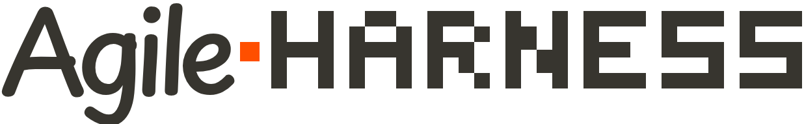
</picture>

**Spec-driven development where the spec is a board, and the columns do the work —
with the laptop closed.**

One markdown file per story carries the whole lifecycle. Some columns *refuse* a card that
isn't ready. Others *run an agent* the moment it arrives. It runs as a service, so the
work continues whether or not you are watching.

[](./LICENSE)
[](https://github.com/kapstanhq/agileharness/actions/workflows/ci.yml)
[](https://github.com/kapstanhq/agileharness/actions/workflows/security.yml)
[](./AGENTS.md)
[](https://bun.sh)
[](./docs/how-it-works.md#built-on-claude-code)

[Quickstart](#quickstart) · [Features](#features) · [How it compares](#how-it-compares) ·
[Screenshots](#what-it-looks-like) · [Security](#security) · [How it works](./docs/how-it-works.md)

</div>

---

Your coding agent is good at making a change you already specified. It is not good at deciding
what to build, proving the thing is done, or getting it out the door. That gap is where you go
back to being the bottleneck — not writing code, but writing specs, checking acceptance criteria,
and remembering what actually shipped.

AgileHarness closes it by putting **the product itself in your repository**, next to the code, and
giving every column of the board a **precondition an agent has to satisfy before the card can
move**. At the top of it sits a **PRD** — a business document in seven sections, with a companion
file of context written for the agents — and every step inherits it. The board is not a queue you
hand to agents. It's a contract that refuses work that isn't ready — and it keeps enforcing it while
you're asleep. What still needs *you* lands in one **Inbox**, written in plain words, where every
answer is one click.

> **It runs on the Claude Code CLI, and that is not a detail.** The engine spawns the `claude`
> binary for every step that works. There is no provider abstraction — the CLI is proprietary, the
> account is yours, and the runs spend your tokens. What that buys, and what still works without
> it, is in [Built on Claude Code](./docs/how-it-works.md#built-on-claude-code).


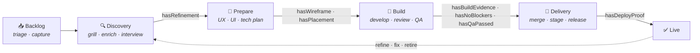

Every arrow with a name on it is a **gate**: a fail-closed check, evaluated from the card's
own data. `hasQaPassed` is not a checkbox someone ticks — it's a field a QA run wrote,
with the commit it validated. A card that skips a step gets stopped by the next one.

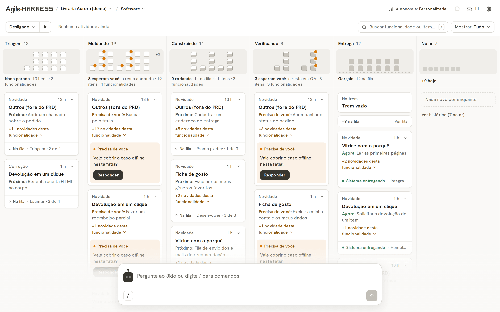

<sub>The demo board that ships with the repository: a fictional bookstore. Each stage shows its items as a
grid of dots over its inner steps (orange: waiting on you), and each card is one feature of the PRD with the
item it is on — <i>Agora</i> (now), <i>Próximo</i> (next) or <i>Precisa de você</i> (needs you, with the
question and a <i>Responder</i> button). The board's agent waits in the composer at the bottom.
<b>The interface is in Portuguese</b> — see <a href="#project-status">Project status</a>.</sub>

## Quickstart

### One command

If you have [Claude Code](https://claude.com/claude-code), paste this and answer a handful of
questions:

```bash
git clone https://github.com/kapstanhq/agileharness && cd agileharness && claude "/harness-setup"
```

That is the whole install. The skill **measures this host** — the CLI it will spawn agents with,
resolved the way the *service* would resolve it and not the way your shell does, the sandbox, git
identity, the inheritable pipeline, whether runtime secrets are outside git — then **fixes what it
can without asking** and stops only for decisions that are yours:

- **A repository, or an idea?** Either way it writes the **PRD first**, because everything else
  descends from it. An idea gets interviewed into one — one question at a time, drafting rather
  than interrogating — and the Business Model Canvas and the first backlog come out of it. An
  existing project gets its PRD proposed from what the code already ships, or imports one you
  already wrote. No code required to start.
- **Local, or a VPS?** It explains what a VPS is, what it costs and why it matters *here* before
  it asks — the premise is that work continues while you are not watching, and on a laptop you are
  the thing that has to stay awake. It configures the machine it is running on, so for a VPS you
  run the same command over there and it writes the service, the proxy and the log rule. Local is
  a fine answer, and moving later costs nothing: the board is files in your repository.
- **Arm the autorun?** The one that spends your tokens. The default is no.
- **Open the MCP surface?** For driving the board from the Claude app on your phone.

It re-measures on every run, so running it twice reports what is already true instead of redoing
it — and it finishes by **proving** the install (the service answers, a tool call returns, a real
card crosses a column) rather than declaring it.

Two things worth knowing before you paste it. It will ask for **sudo** once, to install the two
packages the per-run sandbox needs — the one step that needs your password, and the one whose
absence silently downgrades every autonomous run afterwards. And if your project lives in **another repository**,
have its absolute path ready: root detection cannot tell "the tool" from "your product" on its own,
so it asks rather than guesses.

Already inside a Claude Code session, in this repository? `/harness-setup` on its own does the same
thing.

### Or by hand

```bash
# 1 — prerequisites (Debian/Ubuntu; see the note below, this one is not optional)
sudo apt install bubblewrap socat

# 2 — build and run
bun install
cd packages/storymap-ui
bun run build          # ~4 minutes: ~28 App Router pages. It did not hang.
bun run start
```

Open **http://127.0.0.1:3008** and pick the `demo` board — a fictional bookstore, its stories
grouped by feature. It ships **disarmed**: no column fires an agent. An example should
never spend the tokens of someone who just cloned a repository.

The host measurement is available on its own, with no agent involved:

```bash
node dist/ah-server.mjs --preflight
```

Among other things it compares the `harness-*` skills this release ships (`.claude/skills/`) with the
ones your repository carries — your agents run from **your** copies. A skill the release has and your
repository lacks is `degraded` (the engine could dispatch a role with no instructions); one that differs
is a warning, since you may have customized it. The MCP tool `sync_skills` copies only the missing ones,
through a session worktree and the merge train; it overwrites a differing skill only when you name it
(`overwrite: ["harness-qa"]`).

**Requirements.** [Bun](https://bun.sh), Node 20+, and the **Claude Code CLI** — not bundled, not
optional, and the reason it isn't is [its own section](./docs/how-it-works.md#built-on-claude-code).
Change the port with `AGILEHARNESS_PORT` and the CLI's location with `AGILEHARNESS_CLAUDE`.

<details>
<summary><b>Why the <code>apt install</code> is a prerequisite and not a suggestion</b></summary>

Debian and Ubuntu don't ship `bubblewrap` or `socat`. Without them the per-run containment
doesn't come up, and the default **downgrades every full-autonomy run**: the agent loses
Bash, and the autorun that writes code stops working. The degradation is loud in the log,
but the symptom you notice first is a step failing for lack of a shell — not "install
bubblewrap".

- **Fedora**: `sudo dnf install bubblewrap socat`
- **macOS**: nothing to install — Seatbelt is native.
- **Ubuntu 23.10+** additionally restricts unprivileged user namespaces, which is what
  bubblewrap depends on. [`SECURITY.md`](./SECURITY.md) measures the case and lists the
  ways out.

</details>

<details>
<summary><b>Running it as a service, so it survives the laptop closing</b></summary>

`bun run start` dies with your terminal. The topology this tool was built for is a service that
restarts on boot and keeps working while you are asleep — and the unit that does that is
**generated for your machine**, not copied from a template:

```bash
node dist/ah-server.mjs --generate-systemd-unit
```

It prints the unit and the commands to install it. It never writes to `/etc/systemd/system`
itself — that is more privileged than issuing a credential, which also only prints.

The part that matters is that it pins the **absolute address** of every binary the engine
spawns, rather than trusting the unit's `PATH`. That is not decoration. A service unit pins a
much shorter `PATH` than your shell, and when the Claude Code CLI moved to `~/.local/bin` it
fell outside it: every agent spawn failed for six days with an error that dies inside a card's
console and never reaches the system journal. A declared absolute path fails loudly instead,
naming the variable to fix.

It refuses to emit anything if a binary does not resolve — a unit pinning a path that does not
exist looks like configuration and behaves like a bug.

Once it is up, wire your client to the board:

```bash
node dist/ah-server.mjs --generate-mcp-handle --level write
node dist/ah-server.mjs --print-mcp-client-config --credential <the value it printed>
```

That prints the `claude mcp add` line, an equivalent `.mcp.json`, and — with `--url` — the
public address for the phone app's connector. The credential travels in the URL path, so a
reverse proxy in front of this needs a redaction rule before you publish it; `SECURITY.md`
measures that case.

</details>

<details>
<summary><b>Pointing it at another repository</b></summary>

AgileHarness operates on the repository it runs in, found by walking up for `turbo.json`,
`.git`, or `storymap/boards` — or declared explicitly with `AGILEHARNESS_TARGET=/path/to/repo`.
It requires the **root**: pointing it at a subdirectory is refused on purpose, because git
operations resolve upward and would reach the repository outside.

If you downloaded the ZIP instead of cloning, there is no `.git`: the extracted folder is
still found by the `storymap/boards` that ships in it, and the engine comes up **inert** —
it serves the board and does not act on the repository — until you run `git init` or point
`AGILEHARNESS_TARGET` at a real checkout.

Two things move when you target another repo:

**1 · Runtime state is born in the target repository.** `storymap/.runner/` holds
credentials — the operator token (UI login), the session signing secret, the MCP token and
the handles. Any one of them operates your board, and the board spawns agents with execution
power. The tool creates those files at `0600` and, on first boot, **seeds a
`storymap/.gitignore`** in the target covering `.runner/`. The `0600` defends against
another user on the machine; the ignore rule defends against the repository. If you had
already committed the directory, boot warns you: ignoring it later does **not** untrack what
is in the index, and the remedy is `git rm -r --cached storymap/.runner` **and rotating**
the secrets. A secret that entered a commit is a leaked secret, private repository or not.

**2 · The inheritable pipeline is looked up in the target.** Every board inherits from
`storymap/boards/_base/board.yaml`, and under `AGILEHARNESS_TARGET` that path resolves in the
target's tree — where it doesn't exist yet. Copy it once:

```bash
mkdir -p "$AGILEHARNESS_TARGET/storymap/boards/_base"
cp storymap/boards/_base/board.yaml "$AGILEHARNESS_TARGET/storymap/boards/_base/"
```

Without it, `register_board` **refuses** — and says exactly this — instead of creating a
board with no columns, no gates and no autorun that would show up in the listing as if it
were ready.

</details>

### For agents

If you are an agent, read [`AGENTS.md`](./AGENTS.md) — it's the short route.

The MCP endpoint is off until you turn it on. Nothing enables it for you:

```bash
node dist/ah-server.mjs --generate-mcp-token
```

## Features

**A PRD that agents actually read.** The board's highest document — seven business sections
(problem, personas, value proposition, features, usage flow, success metrics, out of scope), no
technology, in your repo at `storymap/boards/<board>/docs/prd.md`. Everything below descends from
it: the first backlog comes out of its **features** and **usage flow**, and the personas every agent
writes for are its **personas** section. What only the agents need lives beside it, in
`docs/contexto.md` — **decisions already made** (an agent that doesn't know a decision was taken
will take its own), **done when** (verification criteria — "it works" is not one), requirements,
constraints, risks — which the agents read and keep up to date themselves. What reaches a prompt is
a capped digest, not the whole document; an agent that needs the rest calls `read_doc`. The file is **human-owned**: an unattended run that
edits it directly is refused, and the refusal names the proposal path — a draft, with a diff, for
someone to approve. The chat on the screen writes it directly, because there a human is already
reading every word.

**Four groups, one file each.** The navigation is four groups, and each one is a single page over
a single Markdown file of the board: **Business** is the Business Model Canvas (Osterwalder's nine
blocks, `docs/business-model-canvas.md`), **Product** is the PRD (`docs/prd.md`), **Design** is the
style guide (`design/style-guide.md`) and **Software** is the Kanban, over the cards. A page reads its
file, edits it in place with one Edit/Save button, and the composer at the bottom talks to that
document's assistant. Nothing else sits in the navigation: what needs you is in the Inbox, the
machine is behind the gear, and the rest is a request to the chat.

**Features, not a task list.** Stories group under the feature they belong to (the activity → step →
story model underneath), and delivery work (technical, bug, chore, spike) attaches to the node it
*serves*, so infrastructure work never floats free of the user value it enables.

**No scoring, just a position.** There is no prioritization step and no priority score: the order
of the work is the card's position in its Kanban column — the card on top goes first, and the card
menu's «Fazer antes» / «Pode esperar» move it to the top or the bottom. The conductor and
`suggest_work` read the same position; in the conductor's queue only facts of the card (a bug's
severity, a security or personal-data label) jump ahead. A raw pain enters the Triagem as an item to triage; a Business Model Canvas (nine blocks, `docs/business-model-canvas.md`) and the PRD's personas
give agents the shared nouns.

**An Inbox that asks in plain words.** Every item says what happened, what the agent needs from you
and what your options are — and each option is one click: no confirmation dialog, no form before the
button, a receipt with *Undo* afterwards. Questions, delivery approvals, design choices, publications
held back, a quota lock, a red health signal: each arrives with the action that unblocks it. What the
agents are handling on their own is one collapsed line at the end — "the agents are taking care of
(N)" — and the phone rings only for what is critical.

**Autonomy in one control.** One panel, reached from the top bar and from the gear, with two ready
modes. **Mínima**: the agents work and stop at every decision — the plan, the screen, the delivery,
publishing, the deploy. **Máxima**: the agents decide the technical, approve, publish and deploy;
you decide only what is yours. Between them, checkboxes make it granular (approve the plan, pick the
screen, approve the delivery, publish, deploy, go past a card's spending ceiling, let Jido act on the
board, let the Sentinel repair the machine on its own). In Mínima the Sentinel only diagnoses and the
Inbox shows what it found; in Máxima it repairs, under the host's hard lock, with every command recorded.
An independent plan critic gives the «go» to build when the spec box is on, and a reviewer of changes to
existing tests judges them on a business-only board. Two things are **outside any box**: the host's hard
lock, and the decisions only the owner takes — money and pricing, speaking for the brand, the PRD and
its goals, people's data. No mode switches those off.

**Funcionalidades and batches.** The Kanban groups items by the **funcionalidades** written in the PRD
(one `###` each); an item that fits none sits in «Outros (fora do PRD)». An anchor job (Sonnet, a few cards
per run, gated by the board's pace) links existing cards to them and asks you only about the unclear ones;
with three or more similar items left in «Outros» it proposes a new funcionalidade for you to approve. The
card's title opens the funcionalidade's page — the PRD description, what is being done now, what is next,
what needs you and, collapsed, what is done with each delivery's proof — and «Pedir item novo» opens the
chat on it. The conductor takes a new story alone, but may carry several fixes or chores of the SAME
funcionalidade in one session (US$ 10 per item, US$ 30 at most), with one plan stop and one delivery stop
that list every item; an item that fails leaves the batch and goes back to the queue alone. Two
conductors never work on the same funcionalidade at once.

**Gates.** Seventeen named, declarative preconditions, evaluated from the card's own data —
`hasAcceptance`, `hasRefinement`, `hasWireframe`, `hasPlacement`, `hasTechPlan`,
`hasTasks`, `hasBuildEvidence`, `hasCriteriaSpecs`, `hasNoBlockers`, `hasQaPassed`, `hasStaged`,
`hasReleased`, `hasDeployProof` and the reentry briefs. Fail-closed: a gate that cannot measure
refuses rather than passes.

**Autorun.** Per-column triggers, a concurrency cap, light and heavy lanes, an isolated
worktree per run, and live console output. Arming a board is a second, deliberate gesture —
a board is registered disarmed.

**Merge train.** N sessions work in parallel, each in an ephemeral git worktree. Integration
is serialized through a train that pins the submitted sha, runs the entry's declared test units
as a gate (vitest, JUnit or exit-code; affected-only where a unit supports it), sealed in a
transient systemd unit where the host proves it can, recording the exact argv and how many
tests ran, and splits the result: product code to the staging branch, board data to `main`. A
conflict goes back to the session that caused it, not to the operator's lap.

**Design as data.** Beyond the [wireframe DSL](./docs/how-it-works.md#wireframes-the-llm-authors-a-tree-the-code-draws-the-picture): a canvas of screens, components, flows and
notes, a journey graph, structured feedback threaded per artifact, and a published style guide
audited for AA contrast — plus an overlay that turns a click on the *running* interface into a
card, a refinement, or a paste into a live agent session.

**MCP-native.** 107 tools (67 for the board, 40 for dev and ops) plus four resources that
hand an agent the pipeline contract before its first call. The acceptance criterion for this
tool is that *an agent with nothing but MCP and [`AGENTS.md`](./AGENTS.md) can register an
app, arm a board, create a card and watch it cross a column* — with no human in the loop.

**The machine, behind the gear.** A fleet view of live sessions with their claims and worktrees, a
per-run token and cost ledger (the cost also shows on each card and in the quota ring), terminal
attach over WebSocket, a publish queue with an idle window, notifications, the trash, and «Marcar
ajuste» — point at something on the running interface and it becomes an item in the Triagem.

## How it compares

Three families of tools live near this one, and all three are good at what they do.

| | **Spec-driven toolkits**<br/><sub>Spec Kit · Kiro · Tessl</sub> | **Agent orchestrators**<br/><sub>Vibe Kanban · Conductor · Claude Squad</sub> | **Multi-agent frameworks**<br/><sub>Hermes · CrewAI · AutoGen · LangGraph</sub> | **AgileHarness** |
|---|---|---|---|---|
| **Unit of work** | a feature spec | a task or prompt | a goal, decomposed at runtime | a **user story** on a map |
| **Spec lives** | a folder of generated `.md` per feature | — | — | **one file per story**, plus sidecars |
| **Spec's lifespan** | until the code is generated | — | — | **through reentry and retirement** |
| **Where state lives** | in the spec files | app database | dispatcher DB | **markdown in your repo**, under git |
| **What stops bad work** | your review of the spec | you, at PR review | retries, circuit breakers | **gates** — declarative, fail-closed |
| **What a column does** | — | holds a card | dispatches a worker | **runs a skill** |
| **Product context** | — | — | — | **a PRD at the top** · Business Model Canvas · personas · opportunity tree |
| **Parallel work** | — | worktree per agent | concurrency limits | worktree per session + **merge train** with a suite gate |
| **Blast radius** | your shell | your shell | your shell | per-run jail · risk matrix with never-auto classes |

If you want to fan five agents at five tickets and review the PRs yourself, an orchestrator is
lighter and better. If you want a research agent, a coder and a reviewer to negotiate a plan at
runtime, a multi-agent framework is the right shape. If you want one feature specified carefully
before you generate it, Spec Kit is portable and model-agnostic and asks nothing of your process.

AgileHarness answers a different question: **what does a product look like when the backlog, the
acceptance criteria, the design and the release evidence all live in the same repository as the
code, and agents are the ones moving them?**

## What it looks like

Every shot below is the demo board — a fictional bookstore — on a real instance.

### The board

| | |
|---|---|
| [](./docs/screenshots/02-kanban.png) | [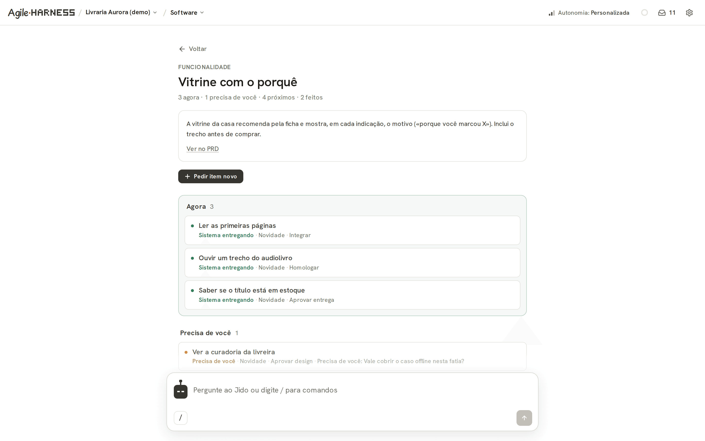](./docs/screenshots/03-feature-page.png) |
| **Kanban.** The home of a board: six stages, one card per PRD feature, the item it is on and what it needs from you. | **A feature.** Its PRD text, then every item that serves it: now, needs you, next, done — and a button to ask for a new one. |
| [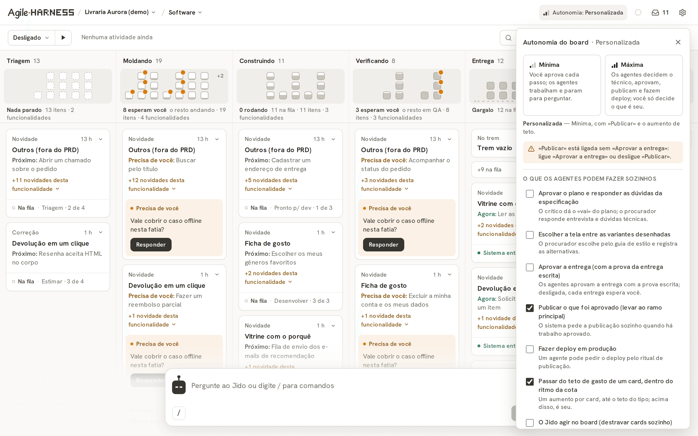](./docs/screenshots/16-autonomy.png) | [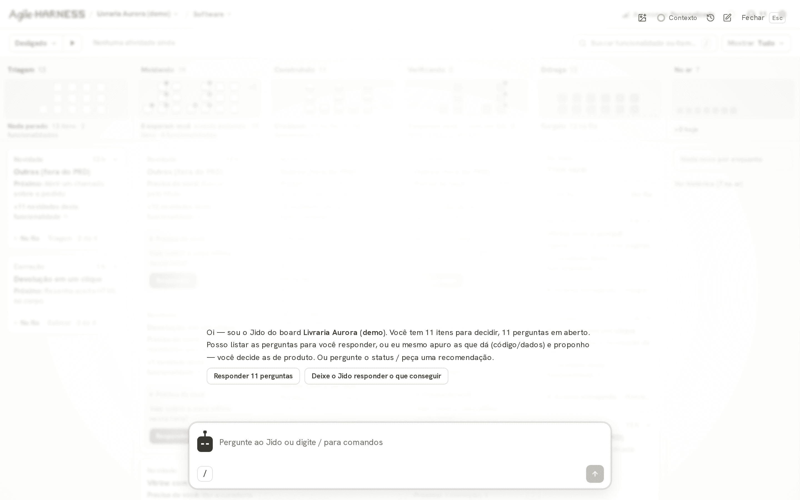](./docs/screenshots/17-chat.png) |
| **Autonomy.** From the top bar: minimum, maximum, or box by box — what agents may do on their own. | **The board's agent.** The composer docked at the bottom of every screen opens the conversation over the page. |

[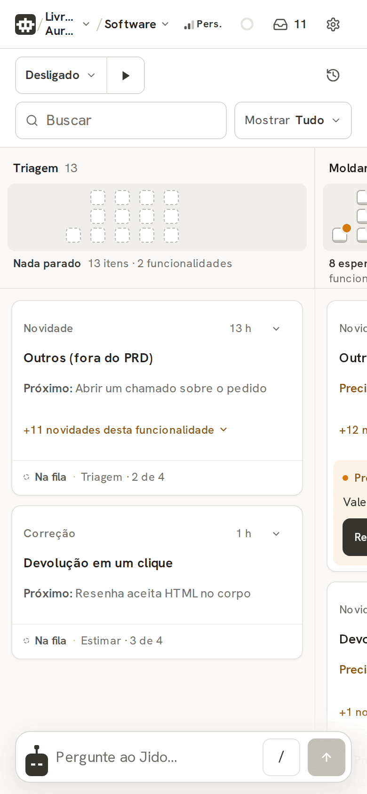](./docs/screenshots/02b-kanban-phone.png)

<sub><b>On a phone.</b> The same Kanban at 390 px: the stages scroll sideways, the composer stays at the bottom.</sub>

### Three documents: Business, Product, Design

The navigation has four groups, and three of them are one page each, over one Markdown file of the board. Each page
reads the file, edits it in place and talks to its own assistant in the composer at the bottom. The fourth group,
Software, is the Kanban.

[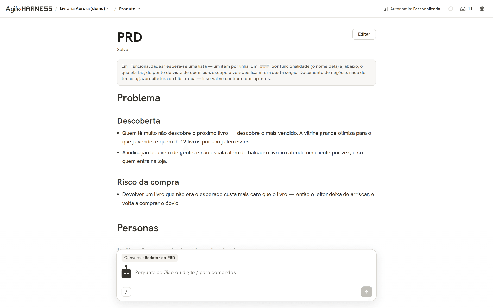](./docs/screenshots/07-prd.png)

<sub><b>Product: the PRD.</b> A business document, with no technology in it: problem, personas, value proposition,
features, the main flow of use, success metrics and what is out of scope. Every card and every run inherits
it as context. The personas are the owner's: an agent proposes a change, and it lands in the Inbox for approval. The
technical context (decisions already made, done-when, requirements, risks, glossary) lives beside it in
<code>docs/contexto.md</code>, which the agents keep and the engine reads. The composer's assistant interviews, sharpens
and checks coherence; <i>ready for an agent</i> reads the PRD as the agent who will build from it.</sub>

| Business: the Business Model Canvas | Design: the style guide |
|---|---|
| [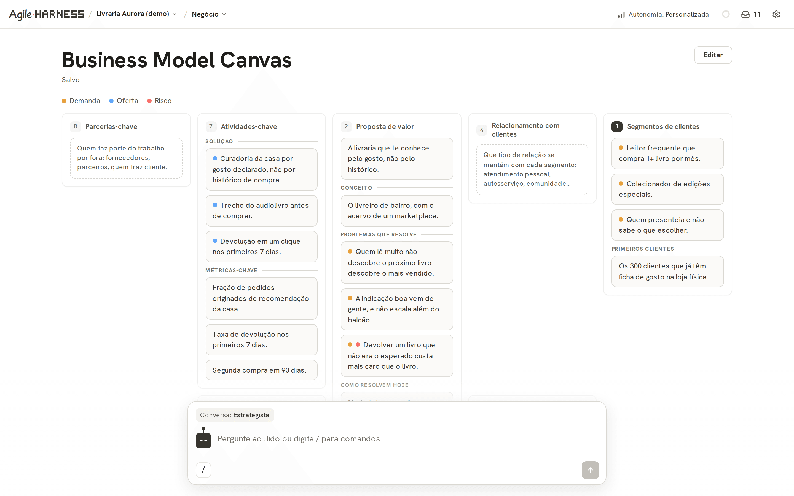](./docs/screenshots/06-business-model-canvas.png) | [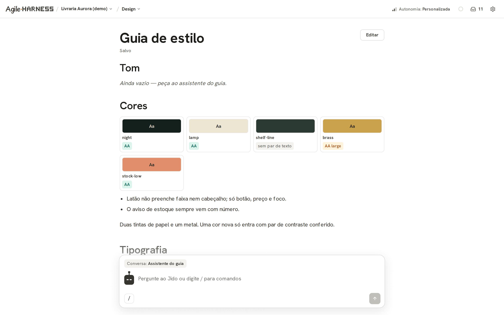](./docs/screenshots/14-style-guide.png) |
| **Business Model Canvas.** Osterwalder's nine blocks in the classic grid, a list on a phone. It is the owner's: an agent proposes a change per block, and it lands in the Inbox. | **Style guide.** Tone, colours (each pair checked for AA contrast), typography, aesthetics and components. The tone is the owner's; the assistant keeps the rest. |

### One card, from question to proof

| | |
|---|---|
| [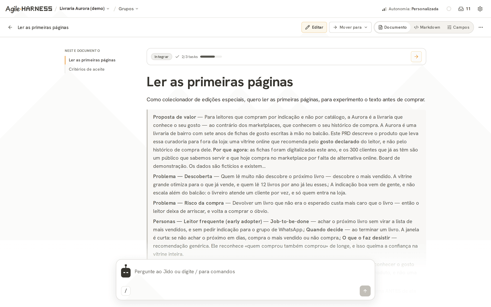](./docs/screenshots/20-card-document.png) | [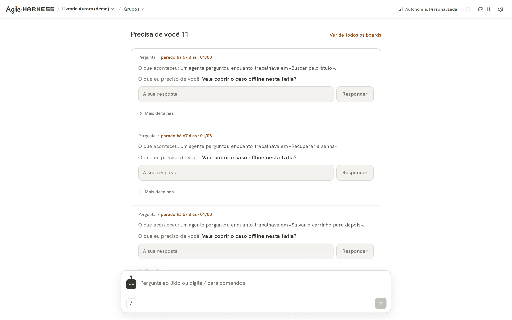](./docs/screenshots/15-inbox.png) |
| **The card as a document.** Narrative, criteria, tasks, findings, design and history in one scroll. | **Inbox.** One place for everything that needs a human — approvals, questions, parked conflicts — answered in place. |

| | |
|---|---|
| [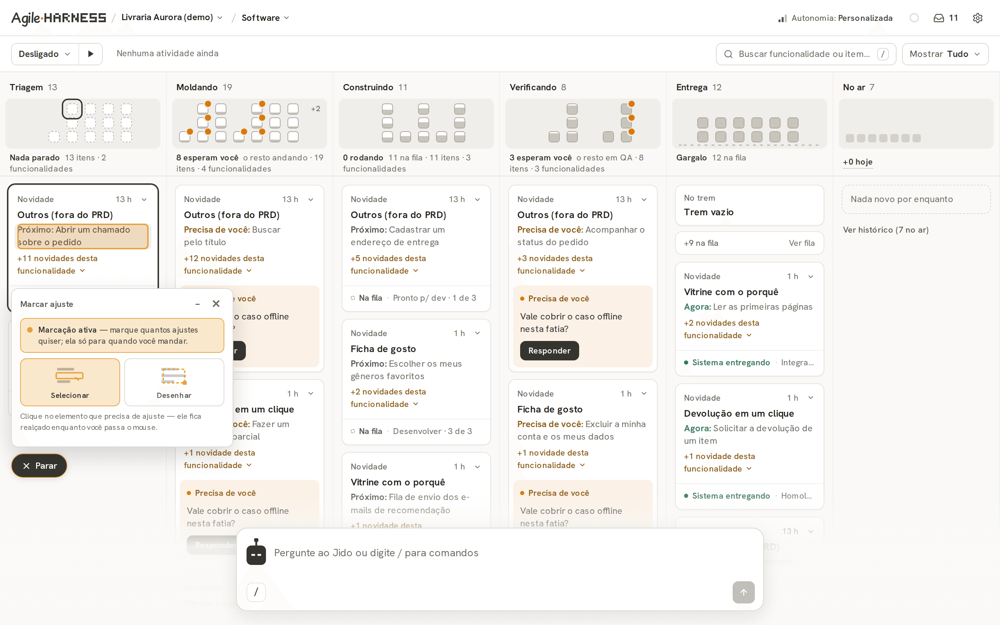](./docs/screenshots/23-feedback-overlay.png) | |
| **Feedback by clicking.** Pick an element or draw a region on the running interface; it becomes a card, a refinement, or a paste into a live agent session. | |

The full list of what changed since the previous navigation — every screen and function, what happened to it and
where it went — is in [`docs/scamper-decisions.md`](./docs/scamper-decisions.md) (in Portuguese).

## Security

Policy and reporting are in [`SECURITY.md`](./SECURITY.md); the trust model, revocation and the
checklist before exposing beyond loopback are in
[`packages/storymap-ui/SECURITY.md`](./packages/storymap-ui/SECURITY.md). The short version:

**The threat model is single-operator.** No roles, no RBAC. Whoever holds the operator credential
holds the machine, because an armed board spawns agents that edit code and can publish. What the
tool protects is the **perimeter** — session gate, cookie, WebSocket `Origin` check, MCP endpoint.
It binds to loopback by default.

**Runs are contained.** Each run gets a per-run jail — bubblewrap on Linux, Seatbelt on macOS —
with a write envelope, an egress allowlist and denied paths. Containment that cannot come up
**downgrades loudly** rather than passing silently, and CI runs a proof step, not just an install
step.

**Some risk classes can never be automatic.** Twelve classes (`read`, `write-board`, `run`,
`session`, `merge-resolve`, `deploy`, `run-free`, `destructive`, …) each carry a disposition of
`auto`, `ask` or `never`. `run-free` and `destructive` may never be `auto`, whatever a board
declares — a lint reproves the config *and* the resolver clamps `auto → ask` at call time, because
a lint can be bypassed by hand-editing YAML and a clamp cannot.

**The largest declared risk is content the board ingests.** Cards, sidecars, diffs, agent output
and free-text capture are untrusted input on their way into an agent's context. Turning any of it
into a command is in scope and is the class most likely to produce a real report.

**Supply chain is enforced, not documented.** CI runs a strong-copyleft license gate over the
published closure, an SBOM generator, an OSV query, a VEX gate with dated dispositions, a workflow
linter (pinned actions, no hostile-context interpolation, `persist-credentials: false`) and a
secret scanner that sweeps the **tracked tree** with `--fail-on-unscanned`, so an accidental blind
spot fails instead of reporting "clean".

**Reporting.** Use GitHub's private vulnerability reporting — *Security → Advisories → Report a
vulnerability*. Please don't open a public issue for an exploitable flaw: a compromised board is
arbitrary execution on the machine running it, and the window between a public report and a patch
is the attack.

## What it is not

- **Not a task tracker.** If you want a Kanban, there are better and cheaper ones. The value
  here is the column that *works*.
- **Not hosted.** It runs on your machine, in your repository, with your credentials. The
  agents it spawns run there too — and spend your tokens.
- **Not safe by default against yourself.** The brakes exist — gates, the risk matrix,
  per-run containment, human approval for the irreversible — but the design assumes an
  operator who knows what they armed.

## Documentation

| | |
|---|---|
| [`docs/how-it-works.md`](./docs/how-it-works.md) | why it exists, how much it drives, and the techniques |
| [`docs/scamper-decisions.md`](./docs/scamper-decisions.md) | every screen and function of the old navigation, and where it went (Portuguese) |
| [`AGENTS.md`](./AGENTS.md) | the short route, for agents |
| [`SECURITY.md`](./SECURITY.md) | what's in scope, and how to report privately |
| [`CONTRIBUTING.md`](./CONTRIBUTING.md) | how to run it, what CI enforces, and why there is no CLA |
| [`storymap/README.md`](./storymap/README.md) | the canonical schema: cards, gates, pipeline |
| [`storymap/frameworks.md`](./storymap/frameworks.md) | the story types (`storyType`), how to write the narrative, and the triage routing |
| [`storymap/settings.yaml`](./storymap/settings.yaml) | every configuration key, commented |

<a id="project-status"></a>

## Project status

Extracted from a monorepo where it has been running in production for months, orchestrating
real delivery. **The engine is mature; the distribution is new** — you are among the first to
install it outside the house it grew up in. Expect rough edges in installation and
documentation, not in the engine.

Some numbers, since they set expectations better than adjectives: ~1,000 TypeScript source
files, over 400 test files, 7,400+ tests, and a CI that runs lint, two typecheck passes, the build,
the full suite and six security gates on every push (license, workflow lint, tracked-tree secret
scan, lockfile divergence, OSV/EPSS/KEV query, VEX + SCA), publishing an SBOM as it goes.

**The product is in Portuguese, and you should know that before you clone.** The four documents
at the root of this repository are English, and so is [`docs/how-it-works.md`](./docs/how-it-works.md).
Everything else is not: the web interface, the
descriptions of the 107 MCP tools your agent will read, the demo board's content, the code comments
and the commit history. There is no i18n layer — the strings are inline. That is the language the
project was written in, and the translation is moving outside in, along the reader's path: docs
first, then the MCP surface (which is what an adopting agent actually consumes), then the interface.

For an agent this matters less than it looks — an LLM reads Portuguese as well as it reads English,
and the MCP contract is precise regardless. For a human operator it is a real cost, and pretending
otherwise on this page would just move the discovery to four minutes after `bun run build`.

## Contributing

See [`CONTRIBUTING.md`](./CONTRIBUTING.md) — how to run it, what CI enforces, and why there is
no CLA. Open an issue before a large PR; the gates are opinionated and it's cheaper to agree on
the shape first. A bug report that names the commit, says whether the service sat behind a
reverse proxy, and includes the values of `AGILEHARNESS_HOST` and `AGILEHARNESS_DEV` is worth
three that don't.

## License

Apache-2.0 — see [`LICENSE`](./LICENSE) and [`NOTICE`](./NOTICE).
